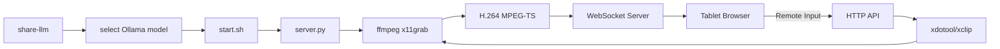

# LLM Share

**Stream your Linux desktop + LLM-powered interactive control to any browser on your local network.**

Select an Ollama model, then stream your laptop and external monitors directly to a tablet or phone. No client-side app needed — just open a URL or scan a QR code.


---

## Features

- **LLM Integration:** Select any Ollama model at startup via `share-llm`. Model choice is passed as `LLM_MODEL` environment variable for downstream tooling.
- **Low Latency:** Optimized pipeline using `ffmpeg` and `mpegts.js` for sub-500ms latency.
- **Interactive Remote Control:** Use your tablet's touch screen to move the mouse, click, scroll, and type on your laptop.
- **Clipboard Sync:** Effortlessly share text between your tablet and laptop.
- **Hardware Accelerated:** Automatically detects and uses **NVENC** (NVIDIA) or **VAAPI** (AMD/Intel) for ultra-efficient encoding.
- **Multi-Monitor Support:** Stream your laptop screen, external monitor, or both side-by-side.
- **Zero Configuration:** mDNS/Zeroconf support (`http://screen-stream.local:8766`) and terminal QR codes for instant access.
- **Smart Zoom & Pan:** Pinch-to-zoom and swipe gestures optimized for mobile browsers.
- **Cursor Highlighting:** Real-time visual feedback of your laptop's cursor position on the tablet.

---

## Quick Start

### 1. Prerequisites

```bash
sudo apt update
sudo apt install ffmpeg xdotool xclip python3-venv ollama
```

### 2. Run

```bash
git clone https://github.com/krsatyam36/llm-share.git
cd llm-share
./share-llm
```

Or skip model selection and run the stream directly:

```bash
./start.sh
```

### 3. Connect

Open the URL printed in your terminal on your tablet's browser. If `qrcode` is installed, scan the QR code.

---

## How It Works



---

## Project Structure

| File | Purpose |
|---|---|
| `share-llm` | Entry point — prompts for an Ollama model, exports `LLM_MODEL`, then launches the stream |
| `start.sh` | Dependency checker and launcher for the server |
| `server.py` | HTTP + WebSocket server that streams screens and handles remote input |
| `index.html` | Client-side web UI with mpegts.js player, touch controls, and keyboard shortcuts |
| `install-service.sh` | Install the server as a systemd service for persistent background operation |
| `packaging/` | Debian packaging scripts (`build-deb.sh` + DEBIAN control files) |

---

## Installation Options

### As a System Command

```bash
sudo ln -sf $(pwd)/share-llm /usr/local/bin/share-llm
```

Now you can run `share-llm` from any directory.

### Systemd Service

```bash
./install-service.sh
```

### Debian/Ubuntu (.deb)

```bash
sudo dpkg -i screen-share-tab_1.0.0_amd64.deb
```

---

## Browser Shortcuts

| Key | Action |
|:---:|---|
| `1` / `2` | Switch to Laptop / External monitor |
| `B` | View both monitors side-by-side |
| `F` | Toggle Fullscreen |
| `←` / `→` | Swipe/Switch between screens |
| `↑` / `↓` | Adjust FPS |
| `L` / `M` / `H` | Quality: Low (600k), Medium (1.5M), High (3M) |
| `C` | Toggle Cursor Highlight |

---

## Security & Ports

The tool uses two ports:
- **8765**: WebSocket (Video Data)
- **8766**: HTTP (Web Interface & Remote Input)

```bash
sudo ufw allow 8765/tcp
sudo ufw allow 8766/tcp
```

*Note: This tool is intended for use on trusted local networks. It does not include built-in authentication.*

---

## Contributing

Contributions are welcome! Feel free to open an issue or submit a pull request.

---

## Author

**Kumar Satyam**
- Email: [kumarsatyam3135@gmail.com](mailto:kumarsatyam3135@gmail.com)
- GitHub: [@krsatyam36](https://github.com/krsatyam36)

---

## License

This project is licensed under the MIT License — see the [LICENSE](LICENSE) file for details.
