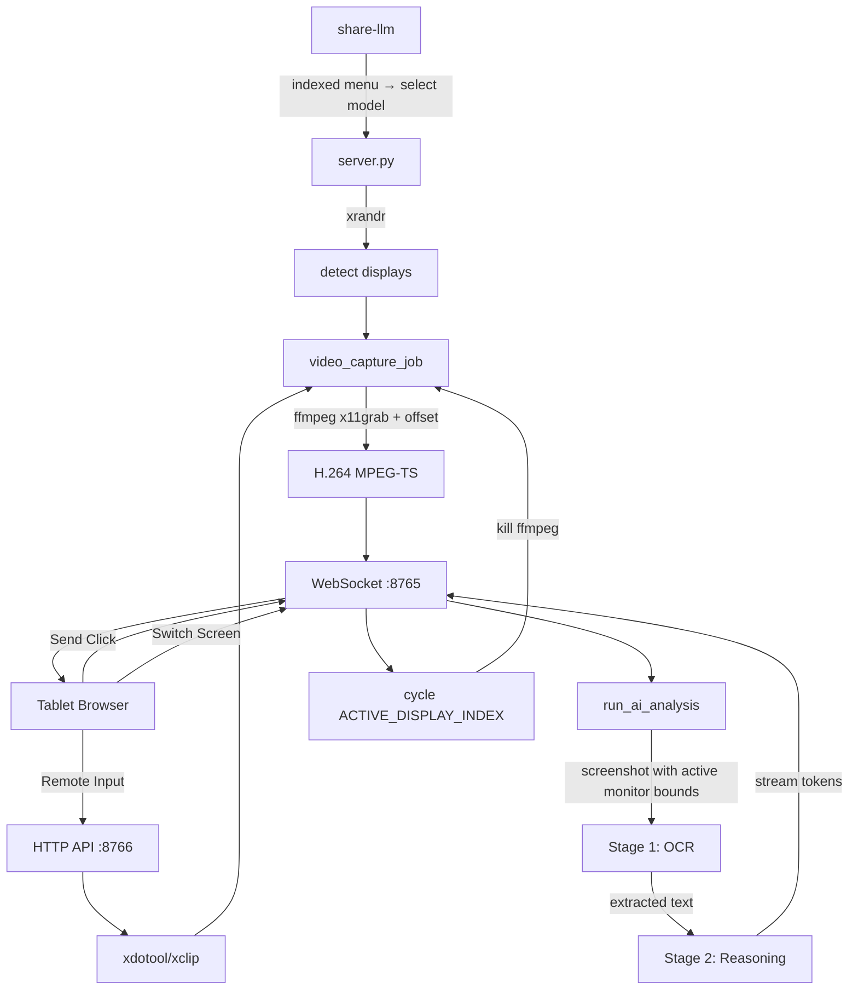

# LLM Share

**Stream your Linux desktop + LLM-powered interactive control to any browser on your local network.**

Select an Ollama model, then stream your laptop and external monitors directly to a tablet or phone. No client-side app needed — just open a URL or scan a QR code.


---

## Features

- **LLM Integration:** Indexed serial-number menu at startup with smart `gemma3:4b` default. Tap the **Send** button on your tablet to trigger on-demand analysis — a two-stage pipeline (OCR → reasoning) extracts text from your screen and feeds it to the selected Ollama model.
- **Dynamic Multi-Monitor Capture:** `server.py` parses `xrandr` output at startup to detect all connected displays. Tap **Switch Screen** on the tablet to cycle through laptop, external monitors, or both — ffmpeg restarts instantly with new bounds.
- **Low Latency:** Optimized pipeline using `ffmpeg` and `mpegts.js` for sub-500ms latency.
- **Interactive Remote Control:** Use your tablet's touch screen to move the mouse, click, scroll, and type on your laptop.
- **Clipboard Sync:** Effortlessly share text between your tablet and laptop.
- **Hardware Accelerated:** Automatically detects and uses **NVENC** (NVIDIA) or **VAAPI** (AMD/Intel) for ultra-efficient encoding.
- **Zero Configuration:** mDNS/Zeroconf support and terminal QR codes for instant access.
- **Smart Zoom & Pan:** Pinch-to-zoom and swipe gestures optimized for mobile browsers.
- **Split-Screen UI:** Resizable video panel alongside an AI response panel with Send and Switch Screen controls.

---

## Quick Start

### 1. Prerequisites

```bash
sudo apt update
sudo apt install ffmpeg xdotool xclip python3-venv ollama
```

### 2. Run

```bash
git clone https://github.com/krsatyam36/llm-share.git
cd llm-share
./share-llm
```

Or skip model selection and run the stream directly:

```bash
./start.sh
```

### 3. Connect

Open the URL printed in your terminal on your tablet's browser. If `qrcode` is installed, scan the QR code.

---

## How It Works



---

## Project Structure

| File | Purpose |
|---|---|
| `share-llm` | Entry point — fetches Ollama models, displays indexed serial-number menu with smart default detection, validates input, activates venv, and launches `server.py` |
| `start.sh` | Standalone dependency checker and launcher (used by systemd service & .deb package) |
| `server.py` | Async HTTP + WebSocket server — parses `xrandr` for dynamic multi-monitor bounds, streams H.264 video, handles remote input, and runs event-driven two-stage AI analysis (OCR → reasoning) on the active monitor |
| `index.html` | Client-side split-screen web UI with mpegts.js player, resizable panels, Send button for AI trigger, and Switch Screen button to cycle monitors |
| `install-service.sh` | Install the server as a systemd user service for persistent background operation |
| `packaging/` | Debian packaging scripts (`build-deb.sh` + DEBIAN control files) |

---

## Installation Options

### As a System Command

```bash
sudo ln -sf $(pwd)/share-llm /usr/local/bin/share-llm
```

Now you can run `share-llm` from any directory.

### Systemd Service

```bash
./install-service.sh
```

### Debian/Ubuntu (.deb)

```bash
sudo dpkg -i screen-share-tab_1.0.0_amd64.deb
```

---

## Client Controls

| Control | Action |
|:---:|---|
| **Send** | Capture the active monitor and run the two-stage AI analysis (OCR → reasoning) |
| **Switch Screen** | Cycle to the next connected display — ffmpeg restarts with the new monitor bounds |

---

## Security & Ports

The tool uses two ports:
- **8765**: WebSocket (Video Data)
- **8766**: HTTP (Web Interface & Remote Input)

```bash
sudo ufw allow 8765/tcp
sudo ufw allow 8766/tcp
```

*Note: This tool is intended for use on trusted local networks. It does not include built-in authentication.*

---

## Contributing

Contributions are welcome! Feel free to open an issue or submit a pull request.

---

## Author

**Kumar Satyam**
- Email: [kumarsatyam3135@gmail.com](mailto:kumarsatyam3135@gmail.com)
- GitHub: [@krsatyam36](https://github.com/krsatyam36)

---

## License

This project is licensed under the MIT License — see the [LICENSE](LICENSE) file for details.
